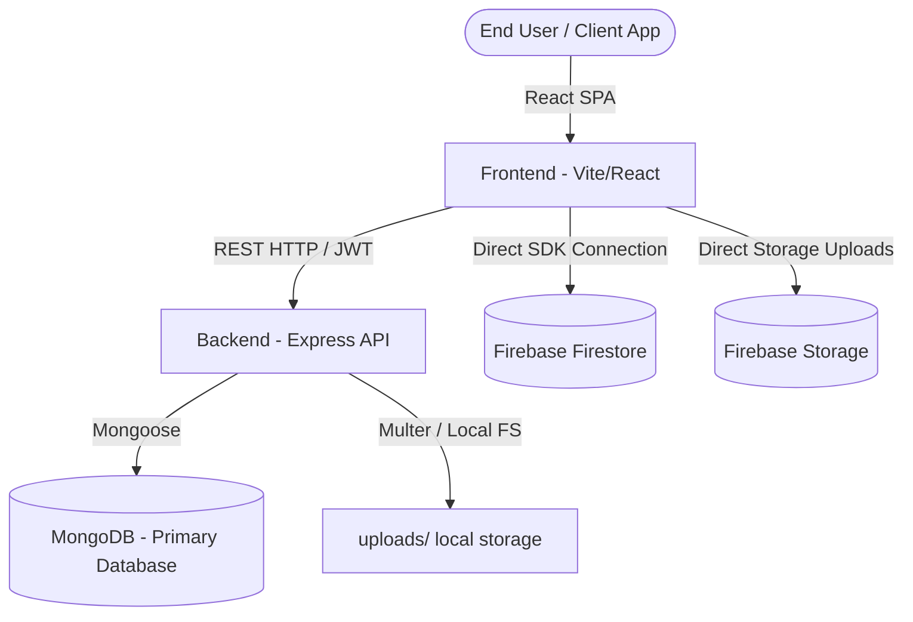

# LUPU Architecture & Database Schema

This document details the system design, deployment layout, role-based access control weight system, and MongoDB + Firestore dual-database strategy of LUPU.

---

## 🏗️ System Overview

LUPU utilizes a hybrid database approach:
- **MongoDB (via Express API)**: Serves as the primary source of truth for core business entities: Users, Vehicles, Accessories, Bookings, and KYC document references.
- **Firebase Firestore**: Powering real-time communication modules (Live Notifications, Chat Inbox, User Reviews, Support Ticket conversations, Disputes, and dynamic system Settings).
- **Firebase Storage / Local uploads**: Used for storage of media assets, identity documents (KYC ID scans), and vehicle registry documents.



---

## 🔑 Authentication & RBAC Hierarchy

LUPU uses a custom OTP authentication flow (Email/Phone) backed by JSON Web Tokens (JWT) signed by the Express backend.

### Role Hierarchy (`roleUtils.js`)
LUPU enforces role-based access controls using role weight values. Higher weights inherit privileges of lower roles:

| Role Name | Weight | Access Description |
|-----------|--------|--------------------|
| `founder` | `100` | Full platform settings control, system parameters, commission adjustments. |
| `super_admin` | `80` | Administrative control over other admins and platform revenues. |
| `admin` | `60` | Approves listings, resolves disputes, reads system audit logs. |
| `owner` | `10` | Vehicle listing, status management, handover logs. |
| `user` | `10` | Booking, KYC upload, and standard profile. |

---

## 🗄️ Database Schemas

### 1. MongoDB Models

#### `User` (Collection: `users`)
Holds core identity, roles, and profile settings.
```javascript
{
  name: { type: String, required: true },
  email: { type: String, unique: true, sparse: true },
  phone: { type: String, unique: true, sparse: true },
  role: { type: String, enum: ['user', 'owner', 'admin', 'super_admin', 'founder'], default: 'user' },
  isRider: { type: Boolean, default: true },
  isOwner: { type: Boolean, default: false },
  otpVerified: { type: Boolean, default: false },
  emailVerified: { type: Boolean, default: false },
  phoneVerified: { type: Boolean, default: false },
  avatar: String,
  college: String,
  address: String,
  notificationPreferences: {
    booking: Boolean,
    vehicle: Boolean,
    payment: Boolean,
    email: Boolean
  },
  collegeIdUrl: String,
  governmentIdUrl: String,
  kycStatus: { type: String, enum: ['unsubmitted', 'pending', 'verified', 'rejected'], default: 'unsubmitted' },
  kycRejectionReason: String
}
```
*Indexes*: `{ role: 1 }`, `{ kycStatus: 1 }`

#### `Vehicle` (Collection: `vehicles`)
Contains listings submitted by owners.
```javascript
{
  name: { type: String, required: true },
  brand: { type: String, required: true },
  model: { type: String, required: true },
  registrationNumber: { type: String, required: true, unique: true },
  type: { type: String, enum: ['bike', 'scooty'], required: true },
  pricePerHour: { type: Number, required: true },
  pricePerDay: { type: Number },
  securityDeposit: { type: Number, default: 0 },
  description: { type: String, required: true },
  location: { type: String, required: true },
  images: [String], // synced with photos
  photos: [String],
  documents: {
    RC: String,
    Insurance: String,
    PUC: String
  },
  helmetAvailable: { type: Boolean, default: false },
  specs: {
    year: Number,
    cc: Number,
    fuel: { type: String, default: 'Petrol' },
    transmission: { type: String, enum: ['Manual', 'Automatic'] }
  },
  verificationStatus: { type: String, enum: ['draft', 'submitted', 'under_review', 'approved', 'rejected'], default: 'draft' },
  status: { type: String, enum: ['draft', 'pending_verification', 'under_review', 'approved', 'rejected'], default: 'draft' },
  isLive: { type: Boolean, default: false },
  ownerId: { type: Schema.Types.ObjectId, ref: 'User', required: true }
}
```
*Indexes*: `{ verificationStatus: 1, isLive: 1 }`, `{ ownerId: 1 }`, `{ status: 1 }`

#### `Booking` (Collection: `bookings`)
Records rental agreements.
```javascript
{
  userId: { type: Schema.Types.ObjectId, ref: 'User', required: true },
  items: [{
    itemId: { type: String, required: true },
    name: { type: String, required: true },
    type: { type: String, enum: ['vehicle', 'accessory'], required: true },
    price: { type: Number, required: true }
  }],
  startTime: { type: Date, required: true },
  endTime: { type: Date, required: true },
  totalAmount: { type: Number, required: true },
  status: { type: String, enum: ['pending', 'confirmed', 'completed', 'cancelled'], default: 'confirmed' },
  agreementAccepted: { type: Boolean, default: false },
  agreementTimestamp: Date
}
```
*Indexes*: `{ userId: 1, status: 1 }`, `{ 'items.itemId': 1 }`, `{ createdAt: -1 }`

---

## 📂 Folder Structure

```
lupu/
├── backend/
│   ├── middleware/
│   │   ├── errorHandler.js       # Centralized HTTP error handling
│   │   ├── rateLimiter.js        # sliding-window OTP rate limit
│   │   └── uploadMiddleware.js   # Multer local image storage configuration
│   ├── models/
│   │   ├── User.js               # User & KYC Schema
│   │   ├── Vehicle.js            # Vehicle listings schema
│   │   ├── Booking.js            # Rental bookings schema
│   │   └── Accessory.js          # Rental accessory listings schema
│   ├── utils/
│   │   └── logger.js             # Structured production console logging
│   ├── server.js                 # API server main file
│   └── seed.js                   # Seed script
├── frontend/
│   ├── src/
│   │   ├── api/
│   │   │   ├── axiosInstance.js  # Main REST backend client instance
│   │   │   └── endpoints.js      # Consolidated API routes
│   │   ├── firebase/
│   │   │   ├── config.js         # Firebase connection credentials
│   │   │   └── firestoreService.js # Firestore CRUD helper calls
│   │   ├── store/
│   │   │   └── authStore.js      # Zustand JWT/RBAC storage state
│   │   ├── utils/
│   │   │   └── schemas.js        # Zod validation forms schemas
│   │   └── App.jsx               # Lazy-loaded router pages definition
└── docs/                         # Developer manuals
```
